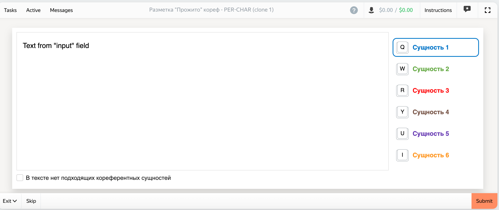

# Прожито 2.0
1. Add the following libraries to Yandex Toloka:
- CSS
  - https://yastatic.net/s3/toloka/presets/TemplateVideoModeration/26a20e48-5dfb-4acc-abbf-a8ab7d91bf3f.css
- JS
  - https://lead-assessors.s3.yandex.net/82652fef-11f6-4f67-8afc-d94daa35d3a9
  - $TOLOKA_ASSETS/js/toloka-handlebars-templates.js (default) 
2. Copy & paste the corresponding code (toloka_interface.js -> js editor etc.) to the task interface 
3. Expected result: 

